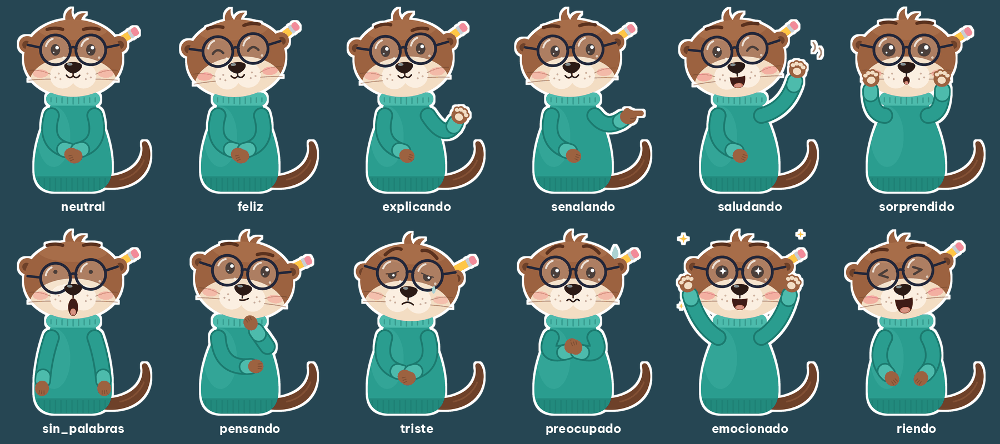

# Nutria — the otter host



A minimalist otter with round glasses, a teal sweater and a pencil tucked behind
the ear, made for "X explicada para nutrias" style videos. Use it with:

```bash
uv run python list_video.py --script my-script.json --assets nutria
```

| Expression | Used for |
|---|---|
| `neutral`, `explicando` | calm explanation (`explicando` presents with an open paw) |
| `senalando` | points at a picture as it pops in (chosen automatically) |
| `saludando` | waves hello in the intro and goodbye in the outro (chosen automatically) |
| `feliz`, `riendo`, `emocionado` | good news, jokes, mind-blowing facts |
| `sorprendido`, `sin_palabras` | shocking numbers ("sin palabras" has the glasses sliding down) |
| `pensando`, `preocupado`, `triste` | questions, risks, sad facts |

Every expression has a `_habla` twin with the mouth open; the renderer swaps
between them following the voice. All PNGs share one canvas, so the body stays
in place while the arms move.

`personaje/` holds the PNGs the renderer reads and `svg/` the editable vector
sources. Both are generated by `build_otter.py`: change a colour (for example
`SWEATER`), a pose or an expression there and run

```bash
uv run python resource/characters/nutria/build_otter.py
```

to redraw everything (it needs Chromium or Chrome to rasterize the SVGs; set
`CHROME=/path/to/chrome` if it is not found). To add your own sounds or a
subscribe animation, copy this folder and add `sfx/` or `suscribete.gif` next to
`personaje/`, then pass the copy with `--assets`.
